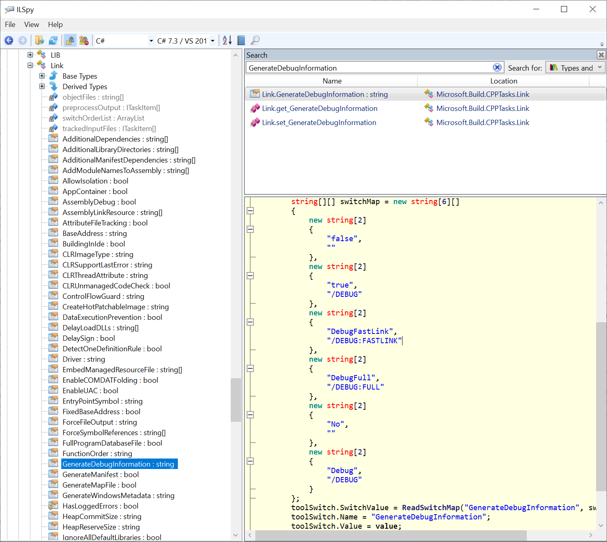

### Q. How to inspect a macro for its value in MS Build?
Ans: We can try below for example to find $(outdir) value
```xml
    <Target Name="testing">
        <Message Text="$(outdir)" />
    </Target>
```
And run **msbuild -t:testing <vcxproj>**

### Q. How to find the valid value of Tags that are allowed in .vcxproj file?
The exact values of .vcxproj properties like ```<GenerateDebugInformation>DebugFull</GenerateDebugInformation>``` can be reverse engineered by looking at **Microsoft.Build.CPPTasks.Common.dll** in Ilspy. Because the documentation really sucks!!


<hr>

# MS Build 101

FROM: https://www.osr.com/nt-insider/2013-issue1/msbuild-101/

For years, the driver development community clamored for integration with Visual Studio. While the application developers lived in the lap of luxury with slick, integrated development and debugging environments, we languished with SOURCES files, command line builds, and a wonky debugger. With the Windows 8 Driver Kit, our cries have finally been answered and driver development has been promoted to first class citizenship by being fully integrated with Visual Studio 2012.

Death to SOURCES!

Being integrated with Visual Studio means many things, from integrated static analysis, to automated deployment, to debugging. For this article, the change that we’re most interested in is the switch from the compilation and linking of drivers being driven by Build, which used SOURCES, DIRS, and MAKEFILEs, to the compilation and linking process being driven by MSBuild and Project Files.

The fact that drivers are now built using MSBuild puts them in good company. This is the current, modern build system provided by Microsoft, thus MSBuild is currently used for all application development, including native, managed, and Windows Store applications. While this may just seem like a burden at first (who wants to learn a new build system?), you’ll quickly get to love the amount of community support available over the old system.

Under the covers, Visual Studio projects are really just MSBuild projects with some custom information used to drive the GUI. For example, Visual Studio adds some information to the project file about which debugger to use while debugging the project. When it comes to learning the new build environment, the thing you really want to know about is MSBuild, not Visual Studio. In fact, MSBuild has a command line interface, which means that you could entirely skip the Visual Studio GUI if you were so inclined!

### Anatomy of an MSBuild Project File

At the end of this article, we provide the entire contents of a simple MSBuild project file for a KMDF driver. Our hope is that by the time you reach the example you’ll be able to understand it and feel comfortable with its structure.

This driver project contains one C module, nothing.c, and a header file located in a sibling directory of the source. In the interest of clarity, this project file does not work properly from within Visual Studio. Instead, we’ll be processing this by directly running MSBuild from within a Visual Studio Tools Command Prompt. This allows us to avoid discussing a lot of things that you can figure out for yourself once you’ve mastered the basics.

MSBuild project files are really just globs of XML. Thus, before we get to the example we’ll describe the various elements commonly found in a project file and some of their uses.

### Project Element

All project files start off with a Project element. This indicates the version of MSBuild required as well as the XML schema to use for validation. We’re using MSBuild version 4.0 and the standard schema:
```xml
<Project ToolsVersion="4.0" 
    xmlns="http://schemas.microsoft.com/developer/msbuild/2003">
</Project>
```

Pretty simple so far, right?

### Property and PropertyGroup Elements

Property elements are an important concept in project files. They are basically a name and value pair, where the name of the property is provided by naming the element and the value is the element contents. Due to the fact that the element name is, in fact, the property, all Property elements must be defined within a PropertyGroup element. There is, however, no restriction on the number of PropertyGroup elements you may have, thus (if you wanted to) you could declare each Property in its own PropertyGroup.

Property elements may have custom names that you create as part of your project, or they may have pre-defined names that are used to pass values to the build procedure. The next step in our project file will be to set some pre-defined Property elements to indicate that we are targeting Windows 8 and that we are building a KMDF driver:
```xml
<PropertyGroup>
    <TargetVersion>Windows8</TargetVersion>
    <PlatformToolset>WindowsKernelModeDriver8.0</PlatformToolset>
    <ConfigurationType>Driver</ConfigurationType>
    <DriverType>KMDF</DriverType>
</PropertyGroup>
```
Property elements can be referenced in the project file using the $(PropertyName)syntax. Thus, if we wanted to reference the target version later in the project file we would use $(TargetVersion).

When MSBuild is invoked, a Property element can be specified on the command line via the /p: switch.

### ItemGroup Element

Item elements are similar to Property elements, but are much more powerful. Instead of being a one to one concept, where a single name corresponds to a single value, Item elements are one to many, with a single name including multiple values. In addition, Item elements can (and often do) have metadata associated with them. As with Property elements, Item elements may have custom names that you create as part of your project or they may have pre-defined names used to pass values to the build procedure. Again, like Property elements are always defined in PropertyGroups, Item elements are always defined within an ItemGroup.

Given that Item elements can have multiple values as well as metadata associated with them, the simple element and value pair that we use to define a Property element is not sufficient to describe an Item. Instead, we’ll use the Include attribute of the element to specify a semicolon delimited list of values to assign to the Item. It is also possible to have multiple definitions of the Item element with separate Include properties, in which case the subsequent values are appended to the previous values. To create metadata for the Item, we simply add child elements in the form of element and value pairs.

In the following example, we define an ItemGroup containing the ProjectConfiguration element. This is another pre-defined element with a pre-defined value for each build configuration that we support.  In this project, we’ll only support building Debug Win32 and Release x64 binaries:
```xml
    <ItemGroup>
        <ProjectConfiguration Include="Debug|Win32">
        </ProjectConfiguration>
        <ProjectConfiguration Include="Release|x64">
            <MyMetaDescription>This is an x64 build</MyMetaDescription >
        </ProjectConfiguration>
    </ItemGroup>
```
In this example, we see two forms of defining an Item element. In the first element, “Debug|Win32”, we do not explicitly provide any metadata. However, for the second element, “Release|x64”, we provide a custom metadata element MyMetaDescription that contains a description of the project configuration.

All Item elements have built in metadata elements, which can be extracted and used as part of expressions. In the final example, we’ll also see that the element value can be something more complex than just a simple string.

Item elements can be referenced within the project file in one of two ways. By using the @(Item) syntax, you can retrieve a semi-colon delimited list of all of the Item values. To access individual metadata elements, you use the @(Item->’%(MetadataElement)’) syntax. We’ll see examples of each of these in the upcoming section.

### Target and Task Elements

Target elements contain one or more Task elements, which use the previously set Property and Item elements to actually do some work. Many Task elements are already provided by MSBuild, Visual Studio, and the WDK and it’s possible to create your own if necessary. When MSBuild is invoked, the Target element to execute is chosen on the command line via the /t: switch.

Let’s add a few Target elements to our project file that invoke the MessageTask element, which is a Task provided by MSBuild for printing messages to the console:
```xml
    <Target Name="PrintProperty">
        <Message Text="Driver Target Version is $(TargetVersion)"/>
    </Target>
    <Target Name="PrintItems">
        <Message Text="@(ProjectConfiguration)"/>
    </Target>
    <Target Name="PrintItemMetadata">
        <Message Text="@(ProjectConfiguration->'%(MyMetaDescription)')"/>
    </Target>
```

The following three command lines result in the following outputs:

• msbuild nothing.vcxproj /t:PrintProperty

“Driver Target Version is Windows8”

• msbuild nothing.vcxproj /t:PrintItems

“Debug|Win32;Release|x64”

• msbuild nothing.vcxproj /t:PrintItemMetadata

“;This is an x64 build”

### ItemDefinitionGroup Element

You’ll note in the previous section that when we printed the metadata of ProjectConfiguration, we received a blank string for the first entry in the element. This is due to the fact that we did not provide a MyMetaDescription metadata element for the first entry.  Here’s the definition of that ProjectConfiguration item group that we saw previously:
```xml
    <ItemGroup>
        <ProjectConfiguration Include="Debug|Win32">
        </ProjectConfiguration>
        <ProjectConfiguration Include="Release|x64">
            <MyMetaDescription>This is an x64 build</MyMetaDescription >
        </ProjectConfiguration>
    </ItemGroup>
```
Notice that, as we just mentioned, there’s no MyMetaDescription for one of the values.  If we wanted to provide a default value for this metadata element in all ProjectConfiguration items, we could define an ItemDefinitionGroup element and create somewhat of a template for any ProjectConfiguration items defined:
```xml
    <ItemDefinitionGroup>
        <ProjectConfiguration>
            <MyMetaDescription>No Description Available</MyMetaDescription>
        </ProjectConfiguration>
    </ItemDefinitionGroup>
```
And we run our PrintItemMetadata task again and get the following results:

msbuild nothing.vcxproj /t:printitemmetadata
“No Description Available;This is an x64 build”

### Import Element

The Import element is an easy one, it simply allows you to include other MSBuild project files that define more Property, Item, and Target elements. Most MSBuild project files are going to have Import elements for the standard MSBuild files:
```xml
    <Import Project="$(VCTargetsPath)\Microsoft.Cpp.Default.props" />
    <Import Project="$(VCTargetsPath)\Microsoft.Cpp.props" />
    <Import Project="$(VCTargetsPath)\Microsoft.Cpp.targets" />
```
### MSBuild Project File Processing

When MSBuild processes a project file, it evaluates all Property and Item elements, including imports, before evaluating the chosen Target. If a Property or Item element is declared multiple times, the last element wins. For example:
```xml
    <PropertyGroup>
        <IncludePath>..\inc</IncludePath>
    </PropertyGroup>
    <PropertyGroup>
        <IncludePath>..\inc_other</IncludePath>
    </PropertyGroup>
```
Results in $(IncludePath) evaluating to, “..\inc_other”. However, Property and Item elements may be self-referential. For example, the following syntax is valid for a Property:
```xml
    <PropertyGroup>
        <IncludePath>..\inc</IncludePath>
    </PropertyGroup>
    <PropertyGroup>
        <IncludePath>$(IncludePath);..\inc_other</IncludePath>
    </PropertyGroup>
```
And provides the desired result of, “..\inc;..\inc_other”.

To extend our ItemDefinitionGroup element, we simply need to use the metadata syntax:
```xml
  <ItemDefinitionGroup>
    <ProjectConfiguration>
      <MyMetaDescription>No Description Available</MyMetaDescription>
    </ProjectConfiguration>
  </ItemDefinitionGroup>
  <ItemDefinitionGroup>
    <ProjectConfiguration>
      <MyMetaDescription>%(MyMetaDescription), seriously!</MyMetaDescription>
    </ProjectConfiguration>
  </ItemDefinitionGroup>
```
And the result:

msbuild nothing.vcxproj /t:printitemmetadata
“No Description Available, seriously!;This is an x64 build”

### Build Related Property and Target Elements

Now that we’ve had our fun, we’d like to actually build some code! In order to drive the build procedure, we need to be sure to supply three bits of interesting information. First is the configuration, meaning whether or not we’re building Debug or Release. This is done by providing a value for the ConfigurationProperty element, typically on the command line.

Next is the platform to build for: x86 or x64. This is done using the Platform Property element, again typically passed on the command line. Annoyingly, MSBuild refers to the x86 platform as, “Win32”, thus you’ll need to use this name when you’re building 32-bit versions of your driver.

Lastly, we need to specify a Target element that will actually do some useful work. The most common Target elements used are Clean, Build, or Rebuild and, again, this is typically specified on the command line.

### Project File Walkthrough

Now we’ve (finally!) covered everything that we need to know to allow us to walk through a functional MSBuild project file. Note that some sections have been abbreviated from what we’ve shown earlier for clarity, though it is 100% functional as shown. In addition, none of the Property or Item elements or values shown here are custom, they are all well-known names that are used by the build procedure.

Example command lines to build this code would be:

msbuild nothing.vcxproj /p:platform=Win32 /p:configuration=Debug /t:rebuild
msbuild nothing.vcxproj /p:platform=x64 /p:configuration=Release /t:build
```xml
<Project ToolsVersion="4.0" xmlns="http://schemas.microsoft.com/developer/msbuild/2003">

    1.
    <PropertyGroup>
      <TargetVersion>Windows8</TargetVersion>
      <PlatformToolset>WindowsKernelModeDriver8.0</PlatformToolset>
      <ConfigurationType>Driver</ConfigurationType>
      <DriverType>KMDF</DriverType>
    </PropertyGroup>

    2.
    <ItemGroup>
        <ProjectConfiguration Include="Debug|Win32"/>
        <ProjectConfiguration Include="Release|x64"/>
    </ItemGroup>

    3.
    <PropertyGroup Condition="'$(Configuration)'=='Debug'">
        <UseDebugLibraries>true</UseDebugLibraries>
    </PropertyGroup>
    <PropertyGroup Condition="'$(Configuration)'=='Release'">
        <UseDebugLibraries>false</UseDebugLibraries>
    </PropertyGroup>

    4.
    <Import Project="$(VCTargetsPath)\Microsoft.Cpp.Default.props" />
    <Import Project="$(VCTargetsPath)\Microsoft.Cpp.props" />

    5.
    <ItemDefinitionGroup>
        <Link>
            <AdditionalDependencies>
                $(DDK_LIB_PATH)\wdmsec.lib;%(AdditionalDependencies)
            </AdditionalDependencies>
        </Link>
    </ItemDefinitionGroup>

    6.
    <ItemDefinitionGroup>
        <ClCompile>
            <AdditionalIncludeDirectories>
                ..\inc;%(AdditionalIncludeDirectories)
            </AdditionalIncludeDirectories>
        </ClCompile>
    </ItemDefinitionGroup>
    <PropertyGroup>
        <IncludePath>$(IncludePath);..\inc</IncludePath>
    </PropertyGroup>

    7.
    <ItemGroup>
        <ClCompile Include="nothing.c" />
    </ItemGroup>

    8.
    <Import Project="$(VCTargetsPath)\Microsoft.Cpp.targets" />
</Project>
```
Let’s talk a bit about the sections in the example shown in Figure 1. The numbers 1-8 in the example correspond to the numbered items described below.

1. The example starts with a PropertyGroup element that defines four properties:
    - TargetVersion – Set to Windows8
    - PlatformToolset – Set to WindowsKernelModeDriver8.0
    - ConfigurationType – Set to Driver
    - DriverType – Set to KMDF

These properties are all “known” to the WDK build environment and cause it to build a KMDF driver for Windows 8. This makes sure that we link to the appropriate libraries, such as the KMDF wrapper, and have the proper include paths set for compilation.

2. We specify our possible configurations as Item elements. In this example, we have two possible configurations: Win32 Debug and x64 Release. Again, this Item element and its values are known to the build environment. Thus, for example, specifying, “Debug|x86” or, “Release|Win64” would result in a build error indicating an unknown project configuration.
3. UseDebugLibraries is another known Property element to indicate whether this is a debug or release build. In the example, we show the optional Conditional attribute used on the PropertyGroup. This is pretty self-explanatory and allows you to conditionally set Property elements, though note that this syntax is not exclusive to PropertyGroup elements.
4. Here we import the standard Microsoft C++ compiler properties. Note that the placement of these statements is important as it will use the previously defined Item and Property elements to construct further elements. Also, we do this before our subsequent statements so that we can pass further information to the compiler and linker by modifying the elements defined by the props files.
5. Passing additional libraries to the linker can only be achieved via an ItemDefinitionGroupthat overrides the Link item’s metadata. Our need to link to wdmsec.lib here is fabricated, but we just wanted to show the technique.
6. We show two ways to modify the include path: one via an ItemDefinitionGroup element and the other via a Property element. There’s no apparent advantage between the two, but we wanted to demonstrate that both methods were viable. Note that the IncludePath property only works because it is handled especially within Microsoft.Cpp.Targets (search, “$(IncludePath)” to see how!).
7. The ClCompile Item element is how we actually tell the compiler which files to compile. It makes sense for this to be an Item instead of a property because we are likely compiling multiple files as part of a project. In our simple project, we have a one value in the item: nothing.c. While there’s nothing special about the item as it is declared here, because nothing.c exists as a file on disk the item takes on special properties. For example, we could use the built in AccessedTime metadata element to get the accessed time of the file.
8. Lastly, we include the Microsoft C++ targets definition file. This is going to define the targets that we use to build, rebuild, or clean our project.

### SOURCES Files are Dead! Long Live…er, SOURCES Files?

It’s really too bad that the Windows 8 Driver Kit didn’t provide XP support. While it takes some getting used to, once you know the basics the new build system is farmore flexible (do some research on, “Property Functions” to see some crazy stuff you can do!) and sane than the previous one. Also, trust me when I say that having a wealth of documentation, books, and forums to reference is a nice change. However, with no ability to build drivers for XP, I’m sure we’ll all be suffering with SOURCES files for many years to come.
