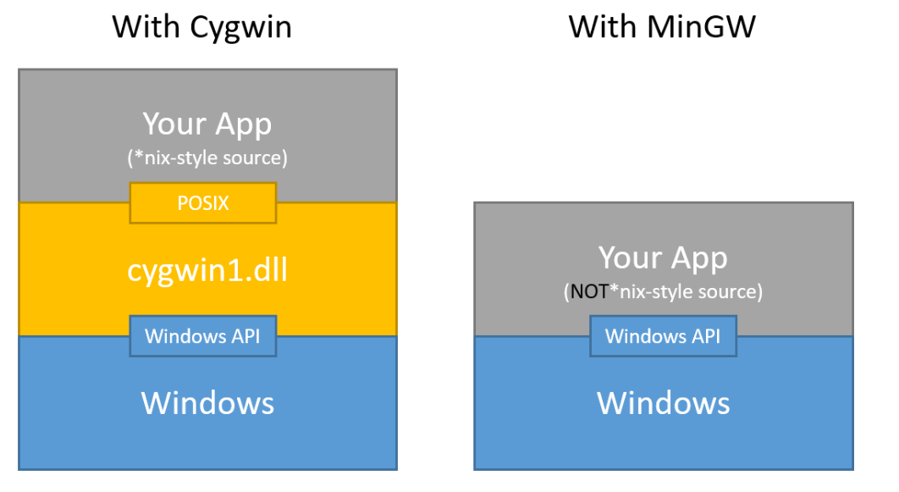

# Clone submodules
git submodule update --recursive --force

# Best open source C projects
- https://git.zx2c4.com/cgit
- https://github.com/acmel/dwarves
- https://github.com/axboe/fio
- https://github.com/dearchap/tinyemu
- https://github.com/dgibson/dtc
- https://github.com/ebiggers/wimlib
- https://github.com/iproute2/iproute2
- https://github.com/jatovm/jato
- https://github.com/jemalloc/jemalloc
- https://github.com/kraj/musl
- https://github.com/libpixman/pixman
- https://github.com/microsoft/msquic
- https://github.com/msteinert/cairo
- https://github.com/pbatard/rufus
- https://github.com/randy408/libspng
- https://github.com/tytso/e2fsprogs
- https://github.com/wireshark/wireshark
- https://gitlab.freedesktop.org/wayland/wayland
- https://kernel.googlesource.com/pub/scm/fs/zisofs/zisofs-tools


# C is awesome

# Quotes
- Know How To Solve Every Problem That Has Been Solved -*Richard Feynman*

# Inspiration
- Projects from https://git.kernel.org/

## Projects for case study(most of these are MingW based)
- wimlib - https://github.com/ebiggers/wimlib
- rufus - https://github.com/pbatard/rufus
- e2fsprogs - https://git.kernel.org/pub/scm/fs/ext2/e2fsprogs.git/
- musl - https://git.musl-libc.org/cgit/musl/tree/

## Posix Standard
- [Posix 2018 Standard](https://pubs.opengroup.org/onlinepubs/9699919799.2018edition/)
- [Downloadable Posix standard](https://pubs.opengroup.org/onlinepubs/9699919799.2018edition/download/)

## Know Your Build Tools(Primarily Microsoft C Compiler)
- MSBuild 101 -
  [articles/msbuild101.md](articles/msbuild101.md)

## Know your compiler
| Option | MS Build Option         | Comments                                                                                            |
| ------ | ----------------------- | --------------------------------------------------------------------------------------------------- |
| /c     |                         | Compile but not link meaning generate .obj                                                          |
| /D     | PreprocessorDefinitions | passed as semicolon separated strings for msbuild or else -D<Macro1\> -D<Macro2\>                   |
| /E     | AdditionalOptions       | Preprocesses C and C++ source files and copies the preprocessed files to the standard output device |

- Some of the options don't have MS Build macros. These options can be specified
  using `<AdditionalOptions>/E %(AdditionalOptions)</AdditionalOptions>` inside
  <Compile\> and <Link\> tags

## Learnings
- *type*_t is the notion used to denote a typedef for *type*
    ```c
    /* This example is from do_journal.c in e2fsprogs */
    struct journal_transaction_s {
    ...
        blk64_t start, end;
    ...
    };
    typedef struct journal_transaction_s journal_transaction_t;
    ```
- Know about headers like stddef.h and stdint.h and when they are supposed to be used.
  - Primarily when to use normal data types like int vs int16_t etc?
  - from https://en.cppreference.com/w/c/types/integer we can sense that
    - **int*_t** version are **exact** width types which might have some perf side effects if the underlying hardware does not support the width natively.
      - For example in visual studio x86/x64 `typedef short int16_t;` and `typedef int int32_t;`
    - **int_fast*_t** on the other hand make sure a suitable width which maps natively to the available hardware type
      - For example in visual studio x86/x64 `typedef int int_fast16_t;` instead of `typedef short int_fast16_t;`
  - **size_t** on the other hand alias to the natural unsigned word length of the hardware for example on x86 `typedef unsigned int     size_t;` and on x64 `typedef unsigned __int64 size_t;`
- Know your compiler [predefined standard macros](https://docs.microsoft.com/en-us/cpp/preprocessor/predefined-macros)
  - On Microsoft compiler
  - _WIN64 - defined when we are compiling for x64 code
  - _WIN32 - defined when both x86 and x64 code is getting compiled
  - _MSC_VER - defines which compiler version are we using, indicate different visual studio versions
  - __cplusplus - defined when the translation unit is compiled as C++
- **[2019-09-08 02:04:47]** We can get a FILE* from HANDLE using below APIs from io.h and fcntl.h
  - `Fd = _open_osfhandle((intptr_t)Handle, _O_TEXT);`
  - `File = _wfdopen(Fd, L"r");` Once we get the FILE* we can use fgets for line oriented string operations
- **[2019-09-08 21:33:31]** [Explore UCRT](articles/UCRT/ucrt.md)
- **[2019-09-15 23:09:58]** Learned about var args and aligned memory
  - Aligned memory means the address returned by the `_aligned_malloc` is always divisible by the alignment we specify.
  - For example: `char *p = _aligned_malloc(10, 4);` the address return in p will be always be divisible by 4. We should also free the allocated memory using `_aligned_free(p)`
  - `atoi(str)` this api also processes input string until it can convert.
    - For example `atoi("123asda")` will still give 123 as the return result.
    - Any whitespace in the beginning of the input string will be ignored. So `atoi("  123asd")` will still return 123
    - It is recommended to use `strto*` functions to convert strings to `int/long/float` types as they also can return pointer to the character which is a non integer
- **[2019-09-18 3:26:58]** UCRT support around [40 POSIX system level APIs](articles/posix_vs_ucrt.md) but most of these have _ prefix to them.
  - wimlib in `wimlib_tchar.h` defines `#define topen _open` for Win32 and `#define topen open` for POSIX systems
  - The take away here is the UCRT implementation even though differ in name the parameters are exactly the same.
  - For example:
  - ```C
      UCRT Win32: int _open(const char *filename, int oflag, int pmode);
      POSIX:      int  open(const char *pathname, int flags, mode_t mode);
    ```
- **[2019-09-22 02:31:39]** We can install only build tools(VC compiler) excluding IDE from https://aka.ms/buildtools
- **[2019-09-25 22:35:19]**
  - Best video on C Standard and some of its less known features - ["New" Features in C - Dan Saks](https://www.youtube.com/watch?v=ieERUEhs910)
    - | Year | C Standard | Comments                       |
      | ---- | ---------- | ------------------------------ |
      | 1983 |            | C standard committee is formed |
      | 1989 | C89        | C89 US standard                |
      | 1990 | C90        | C89 International Standard     |
      | 1999 | C99        | C99 Standard                   |
      | 2011 | C11        | C11 Standard                   |
      | 2018 | C18        | C18 Bugfix release             |
    - `_reserved` - Reserved for global scope. But we can use any identifier with an _ as a local variable or a structure member
    - `__reserved` - Always reserved. Meaning the user program should not use any variable with two underscores __
    - `_Reserved` - Always reserved.  Meaning the user program should not use any variable with an underscore and capital letter.
      - This is the reason why `_Bool` is named that way to prevent breaking existing `bool` typedef used in existing code.
- **[2019-09-25 22:35:19]**
  - Another good video on lesser known C features - [Choosing the Right Integer Types in C and C++ - Dan Saks - code::dive 2018](https://www.youtube.com/watch?v=IJaa58cfvOw)
    - we can use `CHAR_BIT` from `limits.h` instead of 8 for example when you want to print the bits in a integer, we can do below
      ```C
      for (size_t i = sizeof(int) * CHAR_BIT; i >= 0; i--) {...}
      ```
- **[2019-09-26 01:28:14]**
  - `size_t` denotes the native architecture supported natural size. So for 32bit it is 4 bytes unsigned quantity and for 64bit it is 8 bytes unsigned quantity. Hence it is defined as follows
    ```C
    #ifdef _WIN64
        typedef unsigned __int64 size_t;   //8 bytes on x64
    #else
        typedef unsigned int     size_t;   //4 bytes on x86
    #endif
    ```
  - where as `uintmax_t` denotes the maximum integer type that is available in the language. So on a 32bit you could still represent a 64 bit quantity using `long long` even though it not what the architecture directly maps to. So below is how it is defined in both x86 and x64
    ```C
    typedef unsigned long long uintmax_t;  //in MSVC both x86 and x64 support 64 bit quantities using long long
    ```
  - So `size_t` does not give us the maximum unsigned integer, instead it gives us the native unsigned integer i.e., on x86 it will be 32bits and on x64 it is 64bits.
  - So recommendation is to use `size_t` where ever possible instead of using `int`. for example.
    ```C
    int len = strlen(str); // not recommended because on both x86 and x64 of MSVC int is 4 bytes due to LLP64
    size_t len = strlen(str); // recommended because size_t will automatically maps to 4 bytes in x86 and 8 bytes in x64
    ```
- **[2019-09-26 22:14:54]**
  - C11 introduced the concept of static asserts. These are basically conditional asserts which can be evaluated during compile time. So C11 has a new keyword called `_Static_assert(expr, message)` The reason for this ugly name is the same idea of not to break existing code. so for convenience assert.h header provides `static_assert` macro which mean the same.
    - One of the use of static asserts is below
      ```C
      struct book {
        int pages;
        char author[10];
        float price;
      };

      static_assert(sizeof(struct book) == sizeof(int) + 10 * sizeof(char) + sizeof(float),
                    "structure contains padding holes!");
      ```
- **[2019-09-27 06:44:00]**
  - Another good video on some low level details - [Storage Duration and Linkage in C and C++ - Dan Saks](https://www.youtube.com/watch?v=0kgTuWkyorc)
- **[2019-09-27 17:12:49]**
  - `#define _CRT_SECURE_NO_WARNINGS` can be used to disable CRT warning for common functions.
- **[2019-10-04 23:07:45]**
  - 
  - for example, below code compiles on cygwin but not in mingw environment
    ```C
    #include <stdio.h>
    #include <sys/types.h>
    #include <unistd.h>
    int main()
    {
        fork();
        printf("Hello world!\n");
        return 0;
    }
    ```
  - on cygwin, the generated executable has below output from dumpbin
    ```text
    C:\cygwin64\home\vineelko>dumpbin  /imports a.exe
    Dump of file a.exe
    File Type: EXECUTABLE IMAGE
      Section contains the following imports:
        cygwin1.dll
    ...
              229 fork
    ...
    ```
  - Some of the functions of posix family which can be implemented on MSVC like `open` are still supported in Mingw as MSVC already has its counter part `_open` function - [List of supported posix functions can be found here](articles/posix_vs_ucrt.md). Also other functions like `opendir` from `dirent.h`(not present in MSVC) are also available as these can be easily implemented on top of Win32 API.
- **[2019-10-06 20:25:49]**
  - Any ucrt function which begins with `_` is a non standard api provided by ucrt. For example in `string.h`'s
    `_strdup`, `_strlwr`, `_strrev` are some. The take away here is, it is easy to identify which function is part of C standard and which are not. Interestingly some(not all) of these non standard functions are part of posix so in glibc(which implements posix) don't have `_` in them.
  - All posix function in [posix standard](https://pubs.opengroup.org/onlinepubs/9699919799.2016edition/basedefs/stdlib.h.html) with [CX] annotation indicate _Extension to the ISO C standard_ for example, below function from `stdlib.h` is posix extension. UCRT defines a similar api called `_putenv`, since this is not part of C standard, UCRT version has an `_`
    ```C
    stdlib.h - posix
    [CX] int setenv(const char *, const char *, int);
    stdlib.h - ucrt
    int _putenv( const char *envstring );

    stdio.h - posix
    [CX] int fileno(FILE *);
    stdio.h - ucrt
    int _fileno( FILE *stream );
    ```
- **[2019-10-08 17:47:04]**
  - Learned about [CGold: The Hitchhiker’s Guide to the CMake](https://cgold.readthedocs.io/en/latest/). An awesome tutorial about CMake.
  - Now it is super easy to start a C project without worrying about the individual build systems.
    ```CMake
    # CMakeLists.txt - minimum content
    cmake_minimum_required(VERSION 3.4)
    project(command_line_parser)
    add_executable(command_line_parser main.c)

    # commands to run to generate the respective native build files like vcxproj files
    # In below command -S standards for source directory path.
    # -B stands for final directory where vcxproj files are generated
    # CMake only generate one flavor (x64/x86) per project file, here we are generating x64 by specifying x64
    cmake -S . -B builds -G "Visual Studio 16 2019" -A x64
    # we can also use cmake-gui to do the above

    # Once vcxproj files are generated we can either directly build the proj files using Visual Studio
    # or better use cmake itself to build it for us from CMD using msbuild
    cmake --build builds
    ```
- **[2019-10-15 04:41:04]**
  - [Coreboot coding guidelines](https://doc.coreboot.org/coding_style.html) have some good rationale
- **[2020-10-15 00:53:32]**
  - `intsafe.h` has various safe integer conversion/basic arithmetic functions.
  - Fixed size integer types can have below integer literals. i8,i16,i32,i64 for signed and ui8, ui16, ui32, ui64 suffixes
    ```c
    #define INT8_MAX        127i8
    #define UINT8_MAX       0xffui8
    #define INT16_MAX       32767i16
    #define UINT16_MAX      0xffffui16
    #define INT32_MAX       2147483647i32
    #define UINT32_MAX      0xffffffffui32
    #define INT64_MAX       9223372036854775807i64
    #define UINT64_MAX      0xffffffffffffffffui64
    ```


## Going forward
- Experiment with the functions curated in the [Explore Microsoft UCRT](articles/UCRT/ucrt.md)
  - At this stage don't worry about build tools. First get comfortable with the fluently writing code. May be a simple make file should be sufficient for now.
- I need domain knowledge - This includes basic CS knowledge like algorithms + data structures
- Practice writing code for these algorithms and data structures
  - Not just implementing canned text book algo + DS but general algo like implementing crypto algos like md5 checker etc.
- After which I need to master the complexity. Like writing large programs
  - One way to master this is, trying to implement file format parsers. Like, Png parser, Pdf parser.
- Along the process learn the [UCRT library](https://docs.microsoft.com/en-us/cpp/c-runtime-library/crt-library-features) functions and its nitty gritty
  - [CRT Debugging Techniques](https://docs.microsoft.com/en-us/visualstudio/debugger/crt-debugging-techniques?view=vs-2019)
  - [Learn Musl library](https://wiki.musl-libc.org/)